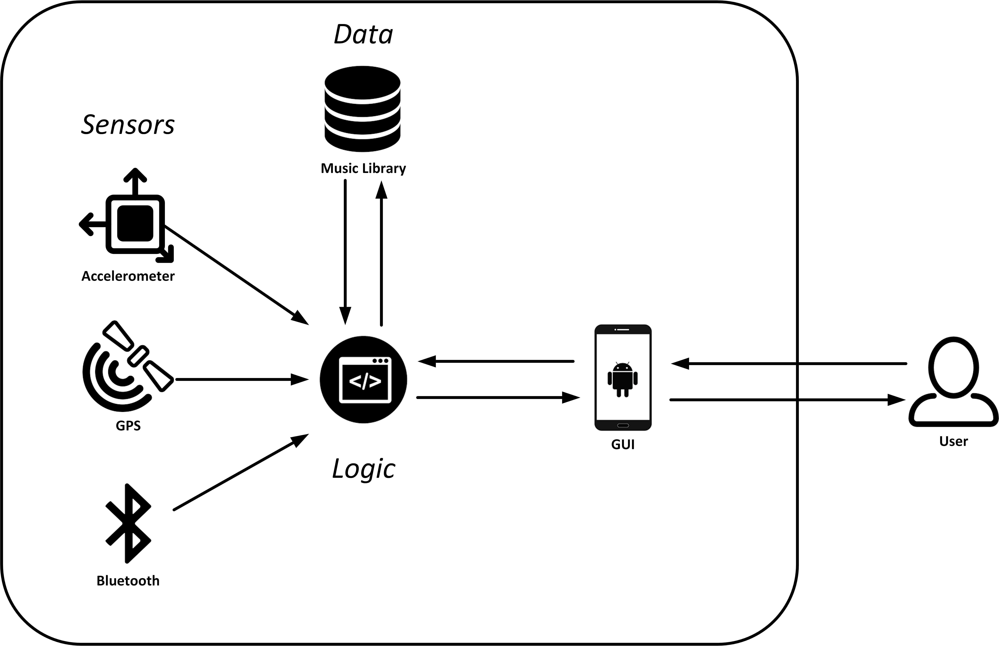

# Praktikum Mobile Sensing for Fitness and Wellbeing

### Idea
This project aims to build a music player application for mobile devices. Unlike other music player apps, that involve users choice of music, it interacts with several sensors to provide songs, which have BPM (beats per minute) rates correlating to the actual moving speed. Thus the user of this application is accompanied with music, that fits his or her walking pace.

### Structure

### Services

### Sensors