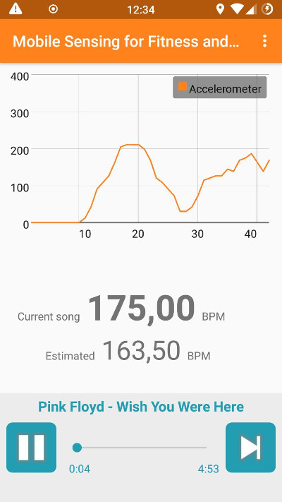

# Praktikum Mobile Sensing for Fitness and Wellbeing

## Installation

1. Check out repositiory 

2. Import with android studio

3. Build and deploy to device

4. Take the audio files from `giantsteps-tempo-dataset/audio` directory and put them on a folder on the device

5. Take the bpm files form `giantsteps-tempo-dataset/annotations/tempo` and put them in the same folder like the audio files

6. Take the genre files from `giantsteps-tempo-dataset/annotations/genre` and put them in the same folder like the audio files

7. Start application and configure the media directory in the settings if necessary (app has to be restarted afterwards!)

IMPORTANT: Every .mp3 file has to have a corresponding .bpm and .genre file, otherwise the app will crash.

## Idea
This project aims to build a music player application for mobile devices. Unlike other music player apps, that involve users choice of music, it interacts with several sensors to provide songs, which have BPM (beats per minute) rates correlating to the actual moving speed. Thus the user of this application is accompanied with music, that fits his or her walking pace.

## Structure

## Sensors

To achieve the desired results there are some sensors implemented. Each sensor provides desired BPM values for the current walking pace.
 
### GPS Sensor
The GPS sensor is part of almost all smartphones and therefore a reliable source of movement data. In this project it's used to obtain the current moving speed. 

The actual speed information is obtained in meters per second. This value than is multiplied with the half of the users height to get a reliable and height-dependent desired BPM value. This equation ensures that smaller users speed are differently valuated than taller ones. This is neccessary because categorizing moving speed in 'slow' or 'fast' isn't a easy task and has strong relationship with the height of the user.

### Accelerometer

## Services

To give best user experience the application makes use of Android services. Thus the application can be put to background or the device can be locked, without any influence to the media playback and sensor logic.

There are two services:

1. Media service: Plays media files, listenes for new media to play and provides information of current playback (e.g. progression).

2. Sensor service: Polls sensor data and decides whether to change the currently played song or not. Also holds the music library which is responsable for choosing the next suitable song if requested.

These services have to interact with eachother and with the GUI (activity). This communicaion is implemented using the broadcast pattern of the Android system.

## Music Library

The Music Library Component consists of the three classes TrackFinder, SongQueue and MusicTrack which are located in the package musicLibrary.

### TrackFinder

The class TrackFinder inherits from the abstract class MusicProvider which is an interface for following three functionalities:

1. Get the next song: The method getNextSong() takes a float value as input and returns a MusicTrack object. The float value is an estimate of the BPM the next song should have and the Method getNextSong() should return a song object with a BPM rate similar to the estimate.

2. Dislike a track: This Method takes a MusicTrack object as input and shifts it into the corresponding low priority queue dependent on its BPM value. This assures that a song disliked by the user won't be played with the same probability as songs which the user has not disliked.

3. Specify media directory: The abstract class method getMediaDirectory is used to set the user-specified directory in which the annotated music for the application is stored.

### Music tracks

A music track encapsulates the attributes of a song, which are its filename, filepath, BPM and genre. The information for a MusicTrack object is extracted from three different file types which have to be located in the same directory for every song. The file types are .bpm, .genre and .mp3 corresponding to the BPM annotation for a track, the genre annotation and its audio file.

### Song queues

A song queue ist a linked list of MusicTrack objects. The object at the beginning of the list will be selected by the getNextSong() method and the object then be put to the end of the linked list. For each 10 BPM interval between the maximum and minimum BPM of the annotated music files, two song queues are created. The getNextSong() method distinguishes low priority queues and high priority queues. If a track has been disliked, it will be pushed into the low priority queue within the same BPM range. The method getNextSong returns only MusicTracks from the high priority queue if the number of elements in it is >= 5. Otherwise it will also return MusicTracks from the low priority queue with some specified probability. This probability is 1, if the number of elements in the high priority queue is 0. 

